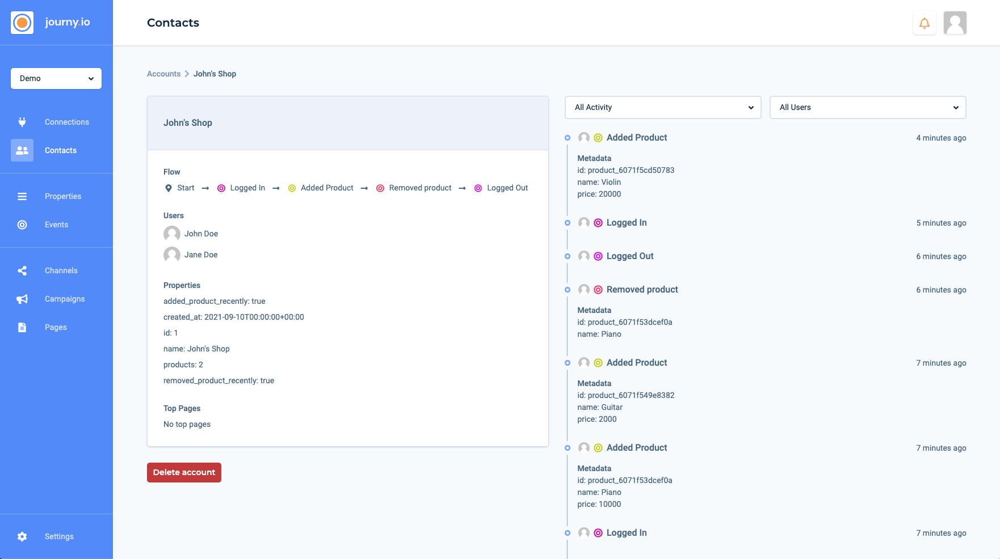

[](https://journy.io/?utm_source=github&utm_content=readme-php-demo-app)

# Demo application PHP SDK

This demo application shows you how you can use our [PHP SDK](https://github.com/journy-io/php-sdk) to track events and update properties.

## Setup

### Install dependencies

```sh
$ composer install
```

### Copy the `.env-example` file and paste your API key generated via [system.journy.io](https://system.journy.io/?utm_source=github&utm_content=readme-php-demo-app)

```sh
$ cp .env-example .env
```

### Start application

```sh
$ php -S localhost:3000 -t public
```

## How it works

The demo application is a shop manager, you can log in with the following users:

* john@acme.com with any password
* jane@acme.com with any password

They are both admin of each other's shop.



* [HandlerLogin.php](src/HandlerLogin.php): The user will be created or updated in journy.io along with the shops where the user is an admin, we'll also send a "logged_in" event
* [HandlerLogout.php](src/HandlerLogout.php): After the user is logged out, we'll send a "logged_out" event
* [HandlerProductsAdd.php](src/HandlerProductsAdd.php): After a product is added, we'll send a "product_added" event
* [HandlerProductsDelete.php](src/HandlerProductsDelete.php): After a product is removed, we'll send a "product_removed" event
